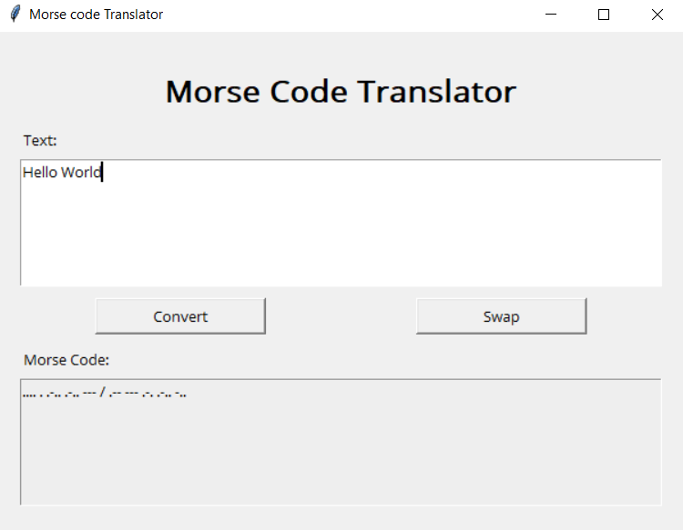

# Morse Code Translator

Morse Code Translator is an application that can decrypt and encrypt morse code and text. It is a script made by python and simple GUI by [tkinter](https://docs.python.org/3/library/tkinter.html).

## Description

This application is an simple GUI for translate morse code to text and to translate text to morse code.
- Use Convert button to encrypt or decrypt your message.
- Use Swap Button to swap between morse code to text and text to morse code.

